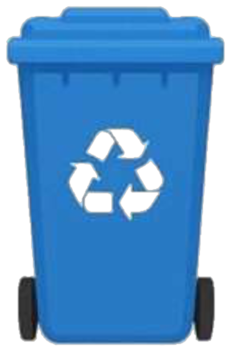
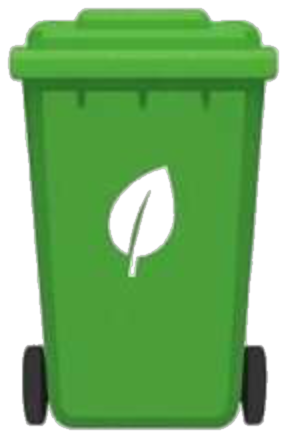
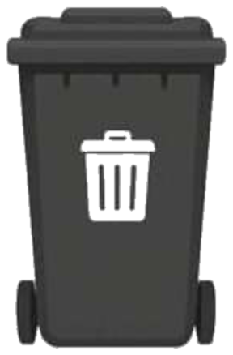
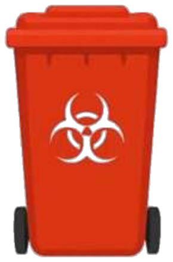
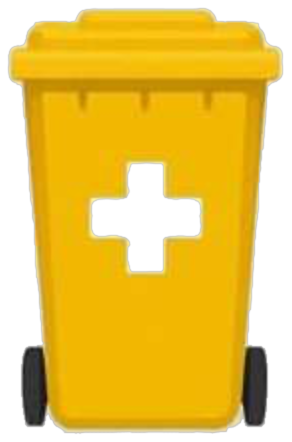

<p align="center">
  
</p>

<h1 align="center">BinBoss</h1>

<p align="center">
  <strong>A local AI waste-sorting assistant for deciding the right dustbin from text, voice, camera input, or spoken results.</strong>
</p>

<p align="center">
  <a href="#quick-start"></a>
  
  
  
  
</p>

<p align="center">
  
  
  
  
  
</p>

---

## Overview

BinBoss helps people sort everyday waste into the correct bin using a local Ollama model. It ships with a polished web UI, camera-based image classification, microphone-friendly input, spoken verdicts in the browser, and a command-line workflow for quick checks.

The app runs locally by default, so it is free to use, does not require cloud API keys, and can be adapted to your city or campus bin rules by editing one JSON config file.

## Highlights

| Feature | What it does |
| --- | --- |
| Local AI classification | Uses Ollama text models to classify typed item descriptions. |
| Camera sorting | Upload or capture an image and classify the visible waste item with a local vision model. |
| Gentle voice assistant | Reads the final bin verdict aloud, with a toggle and a "Hear again" button. |
| Configurable bins | Edit `config/dustbins.json` to match local colors, names, accepted items, and rejection rules. |
| Web + CLI | Use the browser UI, one-shot CLI mode, or an interactive terminal session. |
| LAN mode | Run the UI on your home Wi-Fi so phones and tablets can connect. |
| Safety hints | Applies special handling for e-waste, batteries, chemicals, medicines, bulbs, and other risky items. |

## Tech Stack

<p>
  
  
  
  
  
  
</p>

## Quick Start

### 1. Install Ollama

Install Ollama from [ollama.com](https://ollama.com), then make sure it is running.

### 2. Install Python dependencies

```bash
make install
```

### 3. Pull the local models

```bash
make pull-models
```

This pulls:

| Model | Purpose | Default |
| --- | --- | --- |
| `llama3.2` | Text classification | `OLLAMA_MODEL` |
| `moondream` | Camera/image classification | `OLLAMA_VISION_MODEL` |

### 4. Run the web app

```bash
make run
```

Open:

```text
http://127.0.0.1:8080
```

If port `8080` is busy, BinBoss automatically tries the next available port and prints the URL.

## Use On Your Phone

Run the app on your local network:

```bash
make lan
```

Then open the Wi-Fi URL printed in the terminal, usually:

```text
http://192.168.x.x:8080
```

Your phone and computer need to be on the same network.

## Browser Voice Features

BinBoss supports both voice input and voice output in browsers that expose the Web Speech APIs.

| Control | What it does |
| --- | --- |
| Mic button | Lets you speak the item you want to sort. |
| Speaker toggle | Turns spoken verdicts on or off and saves the choice in the browser. |
| Hear again | Replays the most recent spoken sorting result. |

Spoken verdicts are intentionally short and polite, so the app can be used hands-free while sorting real items.

## CLI Usage

Classify one item:

```bash
make cli ITEM="banana peel"
```

Start an interactive sorting session:

```bash
make interactive
```

List configured bins:

```bash
make list-bins
```

Run the classifier directly:

```bash
python3 waste_classifier.py "old phone" --json
```

## API Endpoints

When the server is running, these endpoints are available:

| Method | Endpoint | Description |
| --- | --- | --- |
| `GET` | `/` | Serves the web interface. |
| `GET` | `/api/health` | Checks Ollama connectivity and available vision model. |
| `GET` | `/api/bins` | Returns configured dustbin metadata. |
| `POST` | `/api/classify` | Classifies a text item. |
| `POST` | `/api/classify-image` | Classifies an uploaded image. |

Text classification example:

```bash
curl -X POST http://127.0.0.1:8080/api/classify \
  -H "Content-Type: application/json" \
  -d '{"item":"plastic water bottle"}'
```

Image classification example:

```bash
curl -X POST http://127.0.0.1:8080/api/classify-image \
  -F "file=@photo.jpg"
```

## Configuration

Bin rules live in:

```text
config/dustbins.json
```

Each bin can define:

| Field | Meaning |
| --- | --- |
| `id` | Stable identifier used by the classifier and UI. |
| `name` | Human-readable bin name. |
| `color` | Display color shown in results. |
| `accepts` | Examples of items that belong in the bin. |
| `reject` | Items that should not go in that bin. |

Current default bins:

| Icon | Bin | ID | Color |
| --- | --- | --- | --- |
|  | Recyclable | `recyclable` | blue |
|  | Organic / Compost | `organic` | green |
|  | General Waste | `general` | black |
|  | Hazardous / Special Collection | `hazardous` | red |
|  | E-waste / Electronics | `ewaste` | orange |

## Environment Variables

| Variable | Default | Description |
| --- | --- | --- |
| `OLLAMA_MODEL` | `llama3.2` | Text model used for item classification. |
| `OLLAMA_VISION_MODEL` | `moondream` | Preferred local vision model for camera sorting. |
| `OLLAMA_HOST` | `http://127.0.0.1:11434` | Ollama API host. |
| `OLLAMA_KEEP_ALIVE` | `15m` | How long Ollama keeps models warm. |
| `OLLAMA_NUM_PREDICT` | `220` | Response token budget for Ollama. |
| `IMAGE_MAX_PX` | `768` | Max image dimension before classification. |
| `DUSTBIN_CONFIG` | `config/dustbins.json` | Custom dustbin configuration path for the web app. |
| `HOST` | `127.0.0.1` | Web server bind host. |
| `PORT` | `8080` | Preferred web server port. |

Example:

```bash
OLLAMA_MODEL=llama3.1 PORT=8090 make run
```

## Project Structure

```text
.
|-- app.py                  # FastAPI server and web/API routes
|-- waste_classifier.py      # Classification prompts, validation, CLI
|-- llm_client.py            # Ollama client wrapper
|-- humorous.py              # Friendly responses for non-waste inputs
|-- config/
|   `-- dustbins.json        # Local bin rules
|-- web/
|   |-- index.html           # Browser UI
|   |-- styles.css           # Visual design
|   |-- app.js               # Client interactions
|   |-- live-bg.js           # Animated background
|   `-- bins/                # Bin icons
|-- requirements.txt
`-- Makefile
```

## Make Commands

| Command | Description |
| --- | --- |
| `make help` | Show available commands. |
| `make install` | Create `.venv` and install dependencies. |
| `make pull-models` | Pull both default Ollama models. |
| `make run` | Start the local web UI. |
| `make lan` | Start the web UI on the local network. |
| `make cli ITEM="..."` | Classify one item from the terminal. |
| `make interactive` | Start interactive CLI mode. |
| `make list-bins` | Print configured bins. |
| `make clean` | Remove the virtualenv and Python cache folders. |

## Troubleshooting

| Problem | Try this |
| --- | --- |
| `Cannot reach Ollama` | Open the Ollama app, then run `ollama list`. |
| Text sorting fails | Run `ollama pull llama3.2`. |
| Camera sorting is unavailable | Run `ollama pull moondream`. |
| Phone cannot connect | Use `make lan`, keep both devices on the same Wi-Fi, and use the printed LAN URL. |
| Wrong local bin rules | Update `config/dustbins.json` to match your municipality. |

## Notes

BinBoss gives practical sorting guidance, but local recycling and hazardous-waste rules vary. For batteries, chemicals, medicines, bulbs, electronics, and anything dangerous, follow your city's official disposal instructions.
